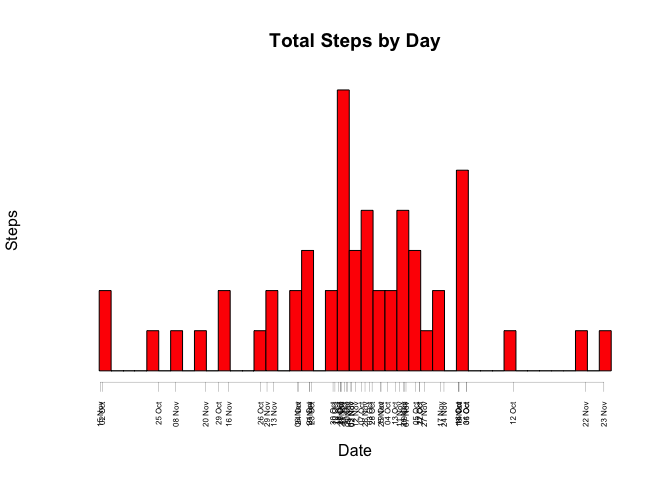
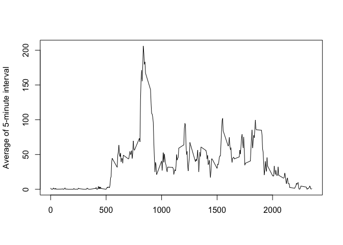
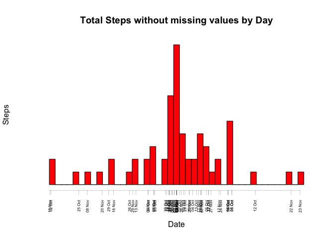
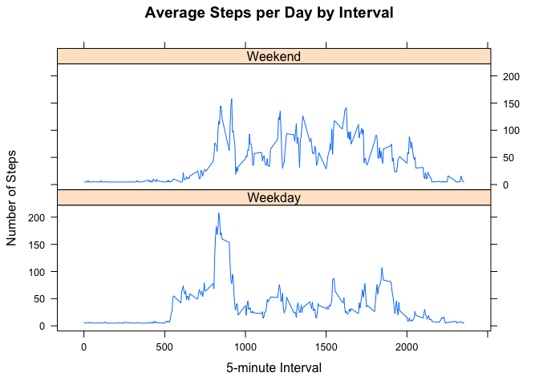

# Reproducible Research: Peer Assessment 1
by Miguel Luis Catalino

##Libraries

We are going to use the Lubricate library for convert the date into the day of the week
and the Hmisc library to use impute function to fill the missing values in the dataset.

```r
library(lubridate)
library(Hmisc)
```

## Loading and preprocessing the data


```r
data <- read.csv("activity.csv")
data$date <- as.Date(data$date)

head(data)
```

```
##   steps       date interval
## 1    NA 2012-10-01        0
## 2    NA 2012-10-01        5
## 3    NA 2012-10-01       10
## 4    NA 2012-10-01       15
## 5    NA 2012-10-01       20
## 6    NA 2012-10-01       25
```


## What is mean total number of steps taken per day?

1. Total number of steps taken per day:


```r
total_step_byday <- aggregate(steps ~ date, data, sum, na.rm = TRUE)
head(total_step_byday)
```

```
##         date steps
## 1 2012-10-02   126
## 2 2012-10-03 11352
## 3 2012-10-04 12116
## 4 2012-10-05 13294
## 5 2012-10-06 15420
## 6 2012-10-07 11015
```

2. Histogram of the total number of steps taken each day


```r
hist(
  total_step_byday$steps,
  col = "red",
  xlab = "Date",
  ylab = "Steps",
  main = "Total Steps by Day",
  breaks = nrow(total_step_byday),
  axes = FALSE
)
axis(
  1,total_step_byday$steps,strftime(total_step_byday$date,"%d %b"),las = 2,lwd =
    0.2,lty = 1,cex.axis = 0.5
)
```

 

3. Mean and median of the total number of steps taken per day


```r
options(scipen = 1)
steps_mean <- mean(total_step_byday$steps, na.rm = TRUE)
steps_median <- median(total_step_byday$steps, na.rm = TRUE)
```
- Average : 10766.1886792
- Median : 10765


## What is the average daily activity pattern?

1. Average number of steps taken per 5-minute interval


```r
avg_step_byday <-
    aggregate(steps ~ interval, data, mean, na.rm = TRUE)
    head(avg_step_byday)
```

```
##   interval     steps
## 1        0 1.7169811
## 2        5 0.3396226
## 3       10 0.1320755
## 4       15 0.1509434
## 5       20 0.0754717
## 6       25 2.0943396
```

```r
    plot(
    avg_step_byday$interval,
    avg_step_byday$steps,
    type = "l",
    xlab = "",
    ylab = "Average of 5-minute interval",
    lwd = "1"
    )
```

 

5-minute interval on average across all the days in the dataset that contains the maximum number of steps

```r
    avg_step_byday[which.max(avg_step_byday$steps),]
```

```
##     interval    steps
## 104      835 206.1698
```


## Imputing missing values

1. Total number of missing values in the dataset

```r
missing<- sum(is.na(data))
```
Missing values = 2304

2. Filling all missing values and create a new dataset using the steps average

```r
    newdata <- data
    newdata$steps <- with(data,impute(data$steps,mean))
    
    head(newdata)
```

```
##     steps       date interval
## 1 37.3826 2012-10-01        0
## 2 37.3826 2012-10-01        5
## 3 37.3826 2012-10-01       10
## 4 37.3826 2012-10-01       15
## 5 37.3826 2012-10-01       20
## 6 37.3826 2012-10-01       25
```

3. Histogram  of the total number of steps taken each day using the new dataset

```r
    total_step_byday_imputed <-
        aggregate(steps ~ date, newdata, sum, na.rm = TRUE)
        head(total_step_byday_imputed)
```

```
##         date    steps
## 1 2012-10-01 10766.19
## 2 2012-10-02   126.00
## 3 2012-10-03 11352.00
## 4 2012-10-04 12116.00
## 5 2012-10-05 13294.00
## 6 2012-10-06 15420.00
```

```r
        hist(
        total_step_byday_imputed$steps,
        col = "red",
        xlab = "Date",
        ylab = "Steps",
        main = "Total Steps without missing values by Day",
        breaks = nrow(total_step_byday_imputed),
        axes = FALSE
        )
        axis(
        1,total_step_byday_imputed$steps,strftime(total_step_byday_imputed$date,"%d %b"),las =
        2,lwd = 0.2,lty = 1,cex.axis = 0.5
        )
```

 

```r
        steps_mean_imputed <- mean(total_step_byday_imputed$steps)
        steps_median_imputed <- median(total_step_byday_imputed$steps)
```
- Steps Average taken by day without missing values : 10766.1886792
- Steps median without missing values: 10766.1886792

Differents between missing values and without missing values  

- Average : 0  
- Median : -1.1886792

The average in both case are the same, however the median with the filling values is greater

## Are there differences in activity patterns between weekdays and weekends?

1. Create a new factor variable in the dataset with two levels – “weekday” and “weekend” indicating whether a given date is a weekday or weekend day.


```r
weekdays <- c("Monday", "Tuesday", "Wednesday", "Thursday", 
              "Friday")
newdata$day<-as.factor(ifelse(is.element(wday(newdata$date, label = TRUE, abbr = FALSE),weekdays), "Weekday", "Weekend"))
head(newdata)
```

```
##     steps       date interval     day
## 1 37.3826 2012-10-01        0 Weekday
## 2 37.3826 2012-10-01        5 Weekday
## 3 37.3826 2012-10-01       10 Weekday
## 4 37.3826 2012-10-01       15 Weekday
## 5 37.3826 2012-10-01       20 Weekday
## 6 37.3826 2012-10-01       25 Weekday
```

Steps Average per 5-minute interval and date

```r
avg_step_byweekday <- aggregate(steps ~ interval+day, newdata, mean, na.rm=TRUE)

head(avg_step_byweekday)
```

```
##   interval     day    steps
## 1        0 Weekday 7.006569
## 2        5 Weekday 5.384347
## 3       10 Weekday 5.139902
## 4       15 Weekday 5.162124
## 5       20 Weekday 5.073235
## 6       25 Weekday 6.295458
```
2. Time series plot 5-minute intervaland the average number of steps taken, averaged across all weekday days or weekend days.

```r
xyplot(avg_step_byweekday$steps ~ avg_step_byweekday$interval|avg_step_byweekday$day, main="Average Steps per Day by Interval",xlab="5-minute Interval", ylab="Number of Steps",layout=c(1,2), type="l")
```

 
